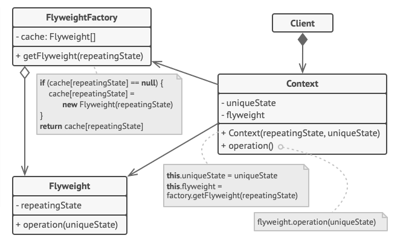

# Flyweight Pattern
O Flyweight é um padrão estrutural que otimiza o consumo de memória RAM ao criar várias instâncias do mesmo objeto. Ele funciona compartilhando os dados imutáveis entre esses objetos, descartando a necessidade de duplica-los em cada instância.

### Problema
Resumindo o exemplo apresentado do [Refactoring.guru](https://refactoring.guru/design-patterns/flyweight),
imagine um jogo de computador em 2D no qual há diversos soldadinhos que pode
atirar vários projetils como balas, mísseis, granadas, entre outros.
Há um sistema de partículas que faz o comportamento desses projetils e está
funcionando muito bem. No entanto, em algumas máquinas mais "fracas"
ocorre de o jogo travar depois de um tempo. Ao analisar o algoritmo dos
projetils, vemos que os campos *Sprite* e *Color* utilizam muita memória.
Como cada projetil é um objeto que contém todos esses dados, em um momento em que
o jogo tem vários inimigos e cada um deles disparando diversos projétils, o jogo
trava.

### Solução
Percebe-se que os dados dos campos Sprite e
Color são idênticos para todas instâncias de projétils (valores *intrínsico*). Ou seja,
todos as balas possuem o mesmo sprite e color, por exemplo.

Outros dados como coordenadas, velocidades, vetor de movimento,
são valores únicos para cada um, e eles mudam o tempo todo de acordo com a situação
de cada projetil (valores *extrínsico*).

O padrão Flyweight otimiza o uso de memória ao separar o estado que varia com o contexto
(extrínseco) do estado essencial do objeto (intrínseco). Isso permite que
múltiplas instâncias do objeto compartilhem o mesmo estado intrínseco,
reduzindo significativamente o número de objetos necessários na memória.

### Diagrama UML

Fonte: [Refactoring.guru](https://refactoring.guru/design-patterns/flyweight)

### Explicando o código de exemplo
**Classe** `ProjetilFlyweight`: É a classe que armazena os dados compartilhados. Todos os dados extrínsicos dos projetils. É a representação de `Flyweight` do diagrama UML acima.

**Método** `draw`: Desenha o projetil no canvas usando a coords. Representa o método `operation(uniqueState)` do UML.

**Classe** `ProjetilFactory`: Responsável por armazenar todos os ProjetilsFlyweights. Cada novo dado Extrínsico diferente dos projetils serão armazenados nessa classe. Representa a classe `FlyweightFactory` do UML.

**Método** `get_projetil`: Verifica se um ProjetilFlyweight já existe para os dados sprite e color dados. Se não, cria um novo e armazena.

**Classe** `Projetil`: Representa o projetil em sí, com os seus dados extrínsicos (coords, vector e speed) que ocupam pouco espaço de memória. E apenas uma referência para os dados intrínsicos (sprite e color) que ocupam grande quantidade de memória. Representa a classe `Context` do UML. Note que, diferente do diagrama, essa classe não faz referência ao Factory.

**Método** `move_and_draw`: Desenha o projetil no canvas conforme o move.

**Classe** `Game`: Representa a lógica do jogo que fará as chamadas de funcionamento dos projétils. Seria nossa classe `Client` do UML. Neste contexto, é essa classe que faz referência ao Factory, diferente no que está representado no diagrama.

